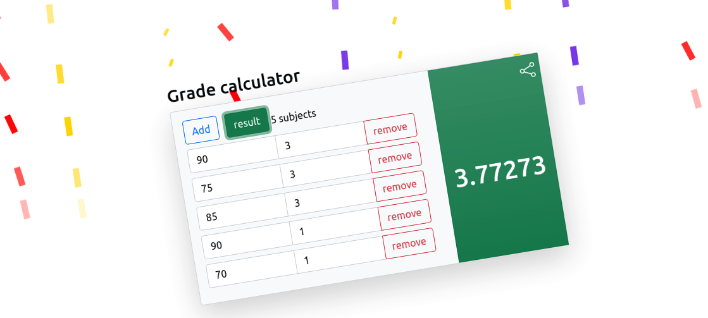

# grade_sys

 This app is intended for grade calculation use. 

 We saw students having a difficult time working their 
grade and as ourselves students we know that
such an experience is a big no.

So, we bring a simple solution with a simple app. 

## About the app
 
 This app is a progressive web app(PWA).
which is an ideal stack to build simple apps with a native experience.

<b> App features:</b>
<ul>
<li>Nice UI and UX</li>
<li>works offline after first use</li>
<li>installable on your device</li>
<li>simple to use</li>
</ul>

## Screenshot

## How to use

